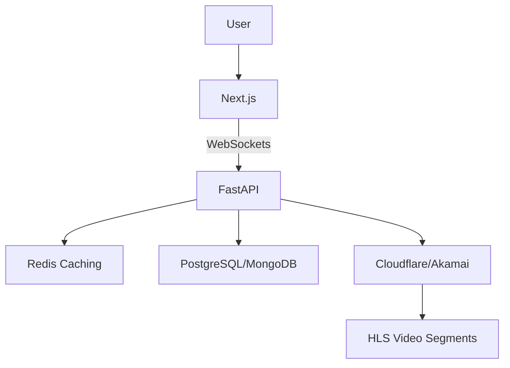

# StreamSync 🚀 – Personalized Streaming, Perfectly Timed


[](https://hackathon-link.com)  
[](LICENSE)  
[](https://nextjs.org/)  
[](https://fastapi.tiangolo.com/)  

## 🚀 About StreamSync
**StreamSync** is a real-time, synchronized streaming platform where users can join at any time and still watch the exact moment as per a global schedule. Built for large-scale streaming events, it ensures zero lag, real-time sync, and adaptive streaming.

🎯 **Hackathon Challenge:** Build a scalable & efficient system for synchronized streaming, handling millions of concurrent users without buffering.  

## 🌟 Features
✅ **Global Timeline Sync** – Late joiners start exactly where they should.  
✅ **Zero Lag, Zero Wait** – Instant playback, no buffering.  
✅ **Real-time WebSockets Sync** – Ensuring frame-perfect alignment.  
✅ **Adaptive Streaming** – Adjusts quality based on network conditions.  
✅ **Smart Caching & CDN Optimization** – Reduces compute and storage costs.  
✅ **Live Chat & Reactions** – Engaging real-time interactions..  

## 🏗 Tech Stack
### **Frontend:**
- 🖥 **Next.js** (React Framework)
- 🎨 **ShadCN + TailwindCSS** (UI Components & Styling)
- 📺 **HLS.js** (Video Streaming Player)

### **Backend:**
- ⚡ **Node.js** (Express Backend)
- 🔌 **WebSockets (Socket.IO)** (Real-time Sync)
- 🔄 **Redis** (Caching & Syncing)
- 🗄 **SQLite** (Database)

### **Streaming & Performance:**
- 📼 **FFmpeg** (Video Processing)
- 🚀 **CDN Integration** (Cloudflare/Akamai)
- ⚖ **Load Balancing & Edge Computing**

## 📸 Screenshots
  

## 🏗 Architecture


## 🚀 Installation & Setup
### **1️⃣ Clone the Repository**
```sh
git clone https://github.com/yourusername/streamsync.git
cd streamsync
```
### **2️⃣ Backend Setup**
```sh
cd backend
npm install
node index.js
```
### **3️⃣ Frontend Setup**
```sh
cd frontend
npm install
npm run dev
```
### **4️⃣ Run Redis (for real-time sync)**
```sh
docker run -d -p 6379:6379 redis
```

## 📖 API Endpoints
| Method | Endpoint | Description |
|--------|-------------|--------------|
| GET | `/stream/:user_id` | Fetch the current stream chunk |
| POST | `/sync` | Sync playback for all users |
| WS | `/ws` | WebSockets connection for real-time sync |

